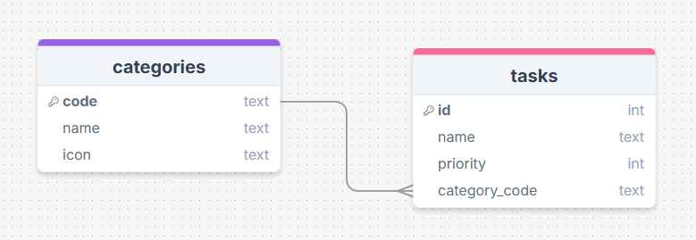
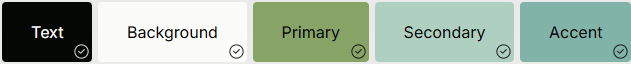
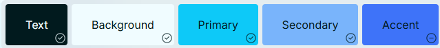

# Sprint 1 - A Working UI Prototype

## Sprint Goals

Develop a prototype that simulates the key functionality of the system, then test and refine it so that it can serve as the model for the next phase of development in Sprint 2.

[Figma](https://www.figma.com/) is used to develop the prototype.

---

## Initial Database Design

Replace this text with notes regarding the DB design.

## Initial UI Prototype

The next stage of prototyping was to develop the layout for each screen of the UI.

This Figma demo shows the initial layout design for the UI:

<iframe style="border: 1px solid rgba(0, 0, 0, 0.1);" width="400" height="700" src="https://embed.figma.com/proto/iILzMl38jYkAkon1egryBJ/Family-To-Do-V1?node-id=1-2&p=f&scaling=scale-down&content-scaling=fixed&page-id=0%3A1&starting-point-node-id=1%3A2&embed-host=share" allowfullscreen></iframe>

### Testing

I show the demo to my host mother to get comments/feedback. 

The feedback:
>There is no description of tasks. 

>It's going to better that it has option to select colours for each tasks.

>I would like to attach a picture not only for groups, but also per tasks.

### Changes / Improvements

I updated the UI of the prototype
- I added a page to delete the task/group.
- Add buttons to move setting page with all of them.
- Change it to upload a pic with all of them.
- made a page to write description of the tasks.

Here is the updated UI flow

<iframe style="border: 1px solid rgba(0, 0, 0, 0.1);" width="400" height="700" src="https://embed.figma.com/proto/oZlbZkB9t1DuZ3BAfeBO0E/Family-To-Do-V2?scaling=scale-down&content-scaling=fixed&page-id=0%3A1&node-id=2-2&starting-point-node-id=2%3A2&embed-host=share" allowfullscreen></iframe>

---

## Refined UI Prototype

### Colours

My host mother said the colour works well but I think it's too simple, so I explored some colour palettes that I thought would work well for Initial settings.

- [Palette 1 Link](https://www.realtimecolors.com/?colors=050704-fbfcfa-87a366-afcfc0-81b3a9&fonts=Inter-Inter)

- [Palette 2 Link](https://www.realtimecolors.com/?colors=011a1e-f0fcff-0dc9f8-79b4fb-3e73f9&fonts=Inter-Inter)

### Testing

Both of them are look well.

I Show these UI to the user, my host mother to see which one is her favourite.

-> She prefer Palette 1.

I based on the feedback, I'll create the app with this colour palette.

### Changes / Improvements

I renewed the UI based on the feedback above. I changed it with the green palette.

<iframe style="border: 1px solid rgba(0, 0, 0, 0.1);" width="400" height="700" src="https://embed.figma.com/proto/lJMHi0EA2JHtsHo1LcQCR4/Family-To-Do-V3?node-id=1-45&p=f&scaling=scale-down&content-scaling=fixed&page-id=0%3A1&starting-point-node-id=1%3A2&embed-host=share" allowfullscreen></iframe>

---

## Sprint Review

I think the design is great and organised. I got some ideas of improvable user-focused.
